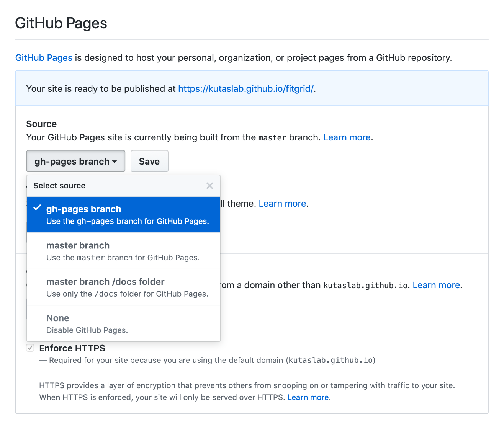
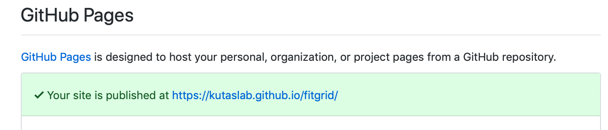

# How to add a Python project with Sphinx documentation to `kutaslab.github.io`

### Dramatis Personæ

- Your **GitHub repo** with Sphinx documentation that can be used to
  generate HTML files.
- **Travis**, a remote service that will clone your repo, generate HTML using
   Sphinx, and put the HTML files where you want them. Configured using
   `.travis.yml`, a file that you put in the repo.
- **GitHub Pages**, a GitHub service that takes HTML files found in a repo and
   puts them up as a website.

### Table of contents

- [Step 1: Prepare your project](#step-1-prepare-your-project)
- [Step 2: Activate Travis](#step-2-activate-travis)
- [Step 3: Create `.travis.yml` in your repo](#step-3-create-travisyml-in-your-repo)
- [Step 4: Tell GitHub to use `gh-pages`](#step-4-tell-github-to-use-gh-pages)
- [Step 5: Add a link to your project on `kutaslab.github.io`](#step-5-add-a-link-to-your-project-on-kutaslabgithubio)


## Step 1: Prepare your project

Make sure that you know the steps needed to successfully run Sphinx on a fresh
copy of your code. For Python projects, this includes:

1. **Installing the dependencies.** To pull out the docstrings in your code,
   Sphinx imports the submodules of your project. Unless all dependencies are
   in place, the imports will fail and Sphinx will complain.
2. **Compiling Cython extensions** if you have them.
3. **Having the correct path prepended to `sys.path` in `conf.py`.** This tells
   Sphinx where to look for your project to import it. For instance, if you
   have the following project structure:

```
project/
    project/
        __init__.py
        code.py
    tests/
    docs/
        source/
            index.rst
            conf.py
```
you need to have these three lines

```python
import os
import sys

sys.path.insert(0, os.path.abspath('../..'))
```
at the top of `conf.py`.

## Step 2: Activate Travis

Travis is a remote service that executes arbitrary code when it detects a new
commit in your repo. We use it to build documentation.

Create a GitHub access token as described
[here](https://docs.travis-ci.com/user/deployment/pages/#setting-the-github-token)
and copy it. For security it's better to only select `public_repo` so Travis
cannot access your private repos.

We assume your repo is under the `kutaslab` organization on GitHub. Go to
https://travis-ci.org/kutaslab, log into your Travis account and activate the
repo. In the repo settings, you will see the following fields:


Enter your GitHub token as follows and click add:


This lets Travis commit generated HTML files back to the repo
on your behalf. 

## Step 3: Create `.travis.yml` in your repo

Here's a sensible starting point:

```yaml
sudo: false
language: python
python:
    - '3.6'
cache: pip
install: # run necessary commands from Step 1
    - pip install numpy pandas scipy # replace with your dependencies
    - python ./setup.py build_ext --inplace # remove if no Cython extensions
script: # build docs
    - pip install sphinx # add what's needed, Sphinx themes/extensions, etc.
    - cd docs # replace with your docs directory
    - make html
    - touch build/html/.nojekyll # let GitHub know we are not using Jekyll
deploy:
    provider: pages
    skip_cleanup: true
    github_token: $GITHUB_TOKEN
    keep-history: true
    on:
        branch: master  # replace with branch you want to use
    target_branch: gh-pages # that's the default anyway, just to be explicit
    local_dir: docs/build/html # replace with your html directory
```

Commit `.travis.yml` in the main project directory and push to GitHub. This
will trigger Travis to start building the documentation.

Open Travis and click Build History for your repo. Select the latest build to
see its status. Most likely, something will fail (you forgot a dependency or
specified the docs directory incorrectly). Check the build log to find the
error, fix it and commit again until Travis succeeds. 

A new `gh-pages` branch should appear in your repo, containing newly generated
HTML files.

## Step 4: Tell GitHub to use `gh-pages`

In the repo settings on GitHub, select `gh-pages` as the branch to use for GitHub Pages and click `Save`:



In a couple minutes the bar will turn green:



You should now be able to see your project documentation under https://kutaslab.github.io/your_project_name.

## Step 5: Add a link to your project on `kutaslab.github.io`

Clone `kutaslab/kutaslab.github.io`, modify `index.rst` to include a link to
your project, then commit and push. For example, you can add:

```rst
* **project_name**: summary of your project

   * `source code <https://github.com/kutaslab/project>`_
   * `documentation <https://kutaslab.github.io/project>`_
```

The link will be visible in a couple minutes.
